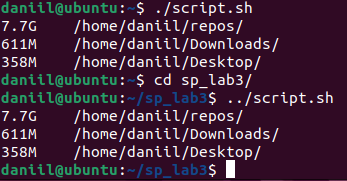

Author: Daniil Berezanshkiy
Group: IO-24
Variant: 2401 % 6 = 1
Task: В порядку зростання вивести на екран вагу та назву 3-х найбільш
“важких” директорій (просто файли пропускаються), що знаходиться
в директорії знаходження скрипта.

 
As we can see, after changing folder but calling same sciprt.sh nothing changed, so it's check only script directory path
